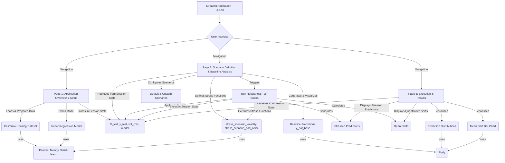

id: 691fda8e680d55964bf2fede_documentation
summary: Scenario-Based Model Robustness Test Documentation
feedback link: https://docs.google.com/forms/d/e/1FAIpQLSfWkOK-in_bMMoHSZfcIvAeO58PAH9wrDqcxnJABHaxiDqhSA/viewform?usp=sf_link
environments: Web
status: Published
# QuLab: Scenario-Based Model Robustness Test

## 1. Introduction and Application Overview
Duration: 05:00

Welcome to the QuLab Codelab on Scenario-Based Model Robustness Testing. In today's data-driven world, machine learning models are deployed in critical applications, from financial trading to healthcare diagnostics. While these models often achieve high accuracy on historical data, their reliability under unforeseen or 'stressed' conditions is paramount. This codelab explores how to systematically evaluate a model's stability and performance when its inputs deviate from normal patterns.

<aside class="positive">
Understanding model robustness is crucial for <b>risk management</b>, ensuring that models do not break down or produce unreliable predictions during adverse events. This is especially vital in domains like finance, where sudden market shifts can have significant consequences.
</aside>

The QuLab application provides a comprehensive guide for developers to:
- Load a dataset and a pre-trained model.
- Define custom stress transformations for input features.
- Apply these transformations to create 'stressed' versions of the input data.
- Generate predictions from the model on both baseline and stressed data.
- Quantitatively measure and visually compare the impact of stress on model predictions.

### Learning Goals:
Upon completion of this codelab, you will be able to:
*   Accept a pre-trained machine learning model and a test dataset as input.
*   Implement a function to apply user-defined stress transformations to specified input columns.
*   Define and execute multiple stress scenarios, comparing their prediction distributions to a baseline.
*   Calculate and display quantitative metrics, such as the mean shift in predictions, for each scenario.
*   Interpret the results of robustness tests and understand their implications for model design, monitoring, and operational constraints, particularly in contexts like finance.

### Robustness Concept:
Given a model $\hat{y} = f_\theta(x)$, we wish to evaluate its stability under stress transformations $T_s$ applied to inputs (e.g., volatility shocks). For each scenario $s$:
$$x^{(s)} = T_s(x), \quad \hat{y}^{(s)} = f_\theta(x^{(s)}).$$
We then compare the distributions of $\hat{y}^{(s)}$ to the baseline predictions to understand the model's behavior under stress.

### Application Architecture Diagram

The Streamlit application is structured across multiple pages, utilizing `st.session_state` to share data and models between them. This modular design allows for a clear workflow from setup to results analysis.



## 2. Environment Setup and Data Preparation
Duration: 07:00

The first step in any machine learning project is to set up the environment and prepare the data. This section covers the necessary library imports and the loading and initial processing of our dataset within the Streamlit application.

### 2.1. Streamlit Application Structure

The application is built using Streamlit and organized into multiple pages for better navigation. The `app.py` file serves as the main entry point, and it dispatches to different pages using `st.sidebar.selectbox`.

The main application file `app.py`:
```python
import streamlit as st
st.set_page_config(page_title="QuLab", layout="wide")
st.sidebar.image("https://www.quantuniversity.com/assets/img/logo5.jpg")
st.sidebar.divider()
st.title("QuLab - Scenario-Based Model Robustness Test")
st.divider()
st.markdown("""
# ... (Introduction and Robustness Concept as above) ...
""")

page = st.sidebar.selectbox(label="Navigation", options=["Application Overview & Setup", "Scenario Definition & Baseline Analysis", "Execution & Results"])
if page == "Application Overview & Setup":
    from application_pages.page1 import run_page1
    run_page1()
elif page == "Scenario Definition & Baseline Analysis":
    from application_pages.page2 import run_page2
    run_page2()
elif page == "Execution & Results":
    from application_pages.page3 import run_page3
    run_page3()
```

### 2.2. Setup and Library Imports

We begin by importing all the necessary Python libraries for data manipulation, machine learning model operations, and visualization. `pandas` will handle our tabular data, `numpy` for numerical operations, `sklearn` for dataset loading, model training, and data splitting, and `plotly` for creating insightful visualizations of prediction distributions and shifts.

The code for `application_pages/page1.py` starts by importing these libraries:
```python
import streamlit as st
import pandas as pd
import numpy as np
from sklearn.datasets import fetch_california_housing
from sklearn.model_selection import train_test_split
from sklearn.linear_model import LinearRegression
# plotly imports are handled on page2 and page3
```

### 2.3. Dataset Loading and Preparation

For this lab, we will use the California Housing dataset, which is a tabular dataset ideal for regression tasks. We will prepare it by splitting it into training and testing sets, and identify key numerical columns that will serve as 'volatility columns' for stress testing. The `@st.cache_resource` decorator ensures that the data loading and preparation only run once, improving performance and avoiding redundant computations.

```python
@st.cache_resource
def load_and_prepare_data():
    housing = fetch_california_housing()
    X = pd.DataFrame(housing.data, columns=housing.feature_names)
    y = pd.Series(housing.target)
    X_train, X_test, y_train, y_test = train_test_split(X, y, test_size=0.3, random_state=42)
    vol_cols = ['MedInc', 'HouseAge', 'AveRooms', 'AveBedrms', 'Population', 'AveOccup']
    return X_train, X_test, y_train, y_test, vol_cols

def run_page1():
    st.title("Application Overview & Setup")
    # ... (omitted markdown for brevity, see app.py for full content) ...

    if 'X_test' not in st.session_state:
        with st.spinner("Loading and preparing data..."):
            st.session_state.X_train, st.session_state.X_test, st.session_state.y_train, \
            st.session_state.y_test, st.session_state.vol_cols = load_and_prepare_data()
        st.success("California Housing Dataset loaded!")

    X_test = st.session_state.X_test
    vol_cols = st.session_state.vol_cols

    st.write("First 5 rows of X_test:")
    st.dataframe(X_test.head())
    st.write("First 5 rows of y_test:")
    st.dataframe(st.session_state.y_test.head())
    st.write("Volatility Columns:")
    st.write(vol_cols)
```

The California Housing dataset provides several numerical features, which makes it suitable for applying "volatility" shocks. We've selected common features such as Median Income, House Age, and Population as `vol_cols` to simulate how changes in these economic or demographic factors might impact housing price predictions.

## 3. Model Training and Baseline Prediction
Duration: 08:00

With our data loaded and prepared, the next crucial step is to train a machine learning model and then generate a set of baseline predictions. These baseline predictions serve as the reference point against which all stressed scenarios will be compared.

### 3.1. Pre-trained Model Initialization and Training

A pre-trained model is required to generate predictions. For demonstration purposes, we will train a simple `LinearRegression` model from `sklearn` on our training data. The `@st.cache_resource` decorator ensures the model training is executed only once, optimizing performance.

```python
@st.cache_resource
def train_model(X_train, y_train):
    model = LinearRegression()
    model.fit(X_train, y_train)
    return model

def run_page1():
    # ... (previous code) ...

    if 'model' not in st.session_state:
        with st.spinner("Training model..."):
            st.session_state.model = train_model(st.session_state.X_train, st.session_state.y_train)
        st.success("Model trained successfully!")
```
We have successfully trained a linear regression model. This model will now be used to generate baseline predictions and predictions under various stress scenarios to evaluate its robustness.

### 3.2. Baseline Predictions

Before applying any stress, we generate predictions on the original `X_test` dataset. These are our baseline predictions, representing the model's normal behavior, against which all stressed scenarios will be compared. This step is handled on the "Scenario Definition & Baseline Analysis" page (`application_pages/page2.py`).

```python
import streamlit as st
import pandas as pd
import numpy as np
import plotly.express as px
import plotly.graph_objects as go
# Stress functions defined here or imported for page2 context

def run_page2():
    st.title("Scenario Definition & Baseline Analysis")

    # Ensure necessary session_state variables are initialized from page1
    if 'X_test' not in st.session_state or 'model' not in st.session_state or 'y_train' not in st.session_state:
        st.warning("Please navigate to 'Application Overview & Setup' first to load data and train the model.")
        return

    X_test = st.session_state.X_test
    model = st.session_state.model

    if 'y_hat_base' not in st.session_state:
        with st.spinner("Generating baseline predictions..."):
            st.session_state.y_hat_base = model.predict(X_test)
        st.success("Baseline predictions generated!")
    y_hat_base = st.session_state.y_hat_base

    st.write("Descriptive statistics of baseline predictions:")
    st.dataframe(pd.Series(y_hat_base).describe())
```
The descriptive statistics for `y_hat_base` provide a summary of our model's predictions under normal conditions. This will serve as the crucial reference point for understanding the impact of stress.

### 3.3. Visualize Baseline Predictions

Visualizing the distribution of baseline predictions helps us understand the model's typical output range and pattern before any external stressors are applied.

```python
def run_page2():
    # ... (previous code) ...
    fig_base = px.histogram(pd.Series(y_hat_base), nbins=50, title="Distribution of Baseline Predictions",
                            labels={"value": "Predicted Value", "count": "Density"}, histnorm='density')
    fig_base.update_traces(marker_color='blue', opacity=0.6)
    fig_base.update_layout(bargap=0.1)
    st.plotly_chart(fig_base)
```
This plot shows the probability density of our model's predictions on the unstressed test data. Its shape (e.g., unimodal, bimodal, skewed) provides initial insights into the model's output characteristics.

## 4. Implementing Stress Transformation Functions
Duration: 10:00

The core of our robustness test lies in the ability to systematically alter input features to simulate various stress conditions. This section details the implementation of two key functions that apply these transformations: a volatility multiplier and a Gaussian noise injector.

### 4.1. `stress_scenario_volatility` Function

The `stress_scenario_volatility` function allows us to multiply specified columns by a chosen factor. This simulates 'volatility shocks' such as sudden economic upturns or downturns.

```python
def stress_scenario_volatility(X_data, factor, vol_cols):
    """
    Applies a volatility shock to specified columns of a Pandas DataFrame.
    Arguments:
    X_data: Pandas DataFrame, the input features to be stressed.
    factor: float, the multiplicative factor.
    vol_cols: list of strings, names of columns to stress. If None, all numerical columns.
    Output:
    Pandas DataFrame, with specified columns modified by the factor.
    """
    stressed_df = X_data.copy(deep=True)
    if vol_cols is None:
        target_cols = stressed_df.select_dtypes(include=np.number).columns
    else:
        target_cols = vol_cols
    if len(target_cols) > 0:
        # Ensure columns exist before attempting to modify
        valid_target_cols = [col for col in target_cols if col in stressed_df.columns]
        if valid_target_cols:
            stressed_df[valid_target_cols] = stressed_df[valid_target_cols] * factor
    return stressed_df
```

<aside class="positive">
The `stress_scenario_volatility` function is designed to be flexible. By changing the `factor`, we can simulate both increases (e.g., `factor=2.0` for a 100% increase) and decreases (e.g., `factor=0.5` for a 50% decrease) in the 'volatility columns'. This function will be the building block for defining our stress scenarios.
</aside>

### 4.2. `stress_scenario_add_noise` Function (Advanced Customization)

The flexibility of this framework allows for defining various types of stress beyond simple multiplicative factors. Users can implement custom functions to simulate more complex real-world phenomena, such as adding random noise, applying thresholds, or simulating specific market event impacts. The `stress_scenario_add_noise` function demonstrates how to introduce random Gaussian noise.

```python
def stress_scenario_add_noise(X_data, noise_std_dev, vol_cols):
    """
    This function introduces random Gaussian noise to specified columns of a Pandas DataFrame,
    simulating unpredictable measurement errors or market fluctuations.
    It creates a deep copy of the input DataFrame to avoid modifying the original data,
    preserving the original test set for baseline comparisons.

    Arguments:
    X_data: Pandas DataFrame, the input features to be stressed.
    noise_std_dev: float, the standard deviation of the Gaussian noise to add (mean is 0).
    vol_cols: list of strings, the names of the columns to add noise to.
              If None, noise is added to all numerical columns in the DataFrame.
    Output:
    Pandas DataFrame, the DataFrame with specified columns having added random Gaussian noise.
    """
    X_stressed = X_data.copy(deep=True)
    if vol_cols is None:
        target_cols = X_stressed.select_dtypes(include=np.number).columns
    else:
        target_cols = vol_cols
    if len(target_cols) > 0:
        valid_target_cols = [col for col in target_cols if col in X_stressed.columns]
        for col in valid_target_cols:
            noise = np.random.normal(loc=0, scale=noise_std_dev, size=len(X_stressed))
            X_stressed[col] = X_stressed[col] + noise
    return X_stressed
```

The `stress_scenario_add_noise` function introduces random Gaussian noise to specified features, simulating unpredictable measurement errors or market fluctuations. By adding this new scenario, we demonstrate how easily the robustness test framework can be extended to cover a wider range of potential stressors.

## 5. Defining and Customizing Stress Scenarios
Duration: 12:00

This section covers how to define and manage various stress scenarios within the application. You'll learn how to use pre-configured scenarios and how to create new, custom stress tests using the available transformation functions.

### 5.1. Initializing Default Scenarios

The application comes with a set of default stress scenarios. These are stored in `st.session_state` to maintain their state across page reloads.

```python
def run_page2():
    # ... (initial code) ...
    vol_cols = st.session_state.vol_cols

    # Initialize default scenarios in session state
    if 'scenarios' not in st.session_state:
        st.session_state.scenarios = {
            'vol_up': {'func_name': 'stress_scenario_volatility', 'params': {'factor': 2.0, 'vol_cols': vol_cols}},
            'vol_down': {'func_name': 'stress_scenario_volatility', 'params': {'factor': 0.5, 'vol_cols': vol_cols}},
            'single_col_spike': {'func_name': 'stress_scenario_volatility', 'params': {'factor': 1.5, 'vol_cols': ['MedInc']}}
        }

    st.subheader("Current Active Scenarios:")
    if st.session_state.scenarios:
        st.write(pd.DataFrame.from_dict(st.session_state.scenarios, orient='index').to_markdown())
    else:
        st.info("No scenarios defined yet. Use the sidebar to add custom scenarios.")
```
We've defined three distinct scenarios: a general 'vol_up' shock across all designated volatility columns, a 'vol_down' shock, and a targeted 'single_col_spike' affecting only the `MedInc` (Median Income) column. These scenarios simulate different types of potential real-world events that could impact the model's inputs.

### 5.2. Adding Custom Scenarios via Streamlit Sidebar

The application provides an interactive way to define new stress scenarios directly from the Streamlit sidebar. This allows users to experiment with different stress types, factors, and target columns without modifying the code.

```python
def run_page2():
    # ... (previous code) ...
    X_test = st.session_state.X_test
    vol_cols = st.session_state.vol_cols

    with st.sidebar.expander("Define Custom Stress Scenario"):
        st.markdown("### Add New Scenario")
        scenario_type = st.selectbox("Select Stress Type", ["Volatility Multiplier", "Add Gaussian Noise"])
        
        new_vol_cols = st.multiselect("Columns to Stress", X_test.columns.tolist(), default=vol_cols)
        new_scenario_name = st.text_input("New Scenario Name", value=f"{scenario_type.replace(' ', '_').lower()}_{len(st.session_state.scenarios)+1}")
        
        new_scenario_params = {}
        new_scenario_func_name = ''

        if scenario_type == "Volatility Multiplier":
            new_factor = st.number_input("Multiplicative Factor", min_value=0.01, max_value=10.0, value=1.5, step=0.1)
            new_scenario_params = {'factor': new_factor, 'vol_cols': new_vol_cols}
            new_scenario_func_name = 'stress_scenario_volatility'
        elif scenario_type == "Add Gaussian Noise":
            new_noise_std_dev = st.number_input("Noise Standard Deviation", min_value=0.0, max_value=5.0, value=0.5, step=0.1)
            new_scenario_params = {'noise_std_dev': new_noise_std_dev, 'vol_cols': new_vol_cols}
            new_scenario_func_name = 'stress_scenario_add_noise'

        if st.button("Add Scenario to List"):
            if new_scenario_name in st.session_state.scenarios:
                st.warning(f"Scenario '{new_scenario_name}' already exists. Please choose a different name.")
            elif not new_scenario_name:
                st.warning("Scenario name cannot be empty.")
            else:
                st.session_state.scenarios[new_scenario_name] = {
                    'func_name': new_scenario_func_name,
                    'params': new_scenario_params
                }
                st.success(f"Scenario '{new_scenario_name}' added!")
                st.rerun() # Rerun to update the displayed scenarios immediately
```

## 6. Executing Robustness Tests
Duration: 08:00

Once the stress scenarios are defined, the next step is to execute them. This involves applying each transformation to the test data and then using the trained model to generate predictions under these stressed conditions. This process is orchestrated on the "Execution & Results" page (`application_pages/page3.py`).

### 6.1. The `execute_scenarios` Function

The `execute_scenarios` function is responsible for iterating through the defined scenarios, applying the respective stress functions, and collecting the new predictions. This function is called when the "Run Robustness Test" button is clicked.

```python
import streamlit as st
import pandas as pd
import numpy as np
import plotly.express as px
import plotly.graph_objects as go

# The stress transformation functions (stress_scenario_volatility, stress_scenario_add_noise)
# are defined here for page3's context to ensure they are available for execution.
def stress_scenario_volatility(X_data, factor, vol_cols):
    stressed_df = X_data.copy(deep=True)
    if vol_cols is None: target_cols = stressed_df.select_dtypes(include=np.number).columns
    else: target_cols = vol_cols
    if len(target_cols) > 0:
        valid_target_cols = [col for col in target_cols if col in stressed_df.columns]
        if valid_target_cols: stressed_df[valid_target_cols] = stressed_df[valid_target_cols] * factor
    return stressed_df

def stress_scenario_add_noise(X_data, noise_std_dev, vol_cols):
    X_stressed = X_data.copy(deep=True)
    if vol_cols is None: target_cols = X_stressed.select_dtypes(include=np.number).columns
    else: target_cols = vol_cols
    if len(target_cols) > 0:
        valid_target_cols = [col for col in target_cols if col in X_stressed.columns]
        for col in valid_target_cols:
            noise = np.random.normal(loc=0, scale=noise_std_dev, size=len(X_stressed))
            X_stressed[col] = X_stressed[col] + noise
    return X_stressed

def execute_scenarios(model, X_data, scenarios_dict):
    stressed_predictions = {}
    # Map function names to actual functions within this scope for execution
    scenario_functions = {
        'stress_scenario_volatility': stress_scenario_volatility,
        'stress_scenario_add_noise': stress_scenario_add_noise
    }
    for name, details in scenarios_dict.items():
        func = scenario_functions.get(details['func_name'])
        if func:
            # Ensure the correct function signature is used for params
            X_stress = func(X_data.copy(), **details['params'])
            y_hat_stress = model.predict(X_stress)
            stressed_predictions[name] = y_hat_stress
    return stressed_predictions

def run_page3():
    st.title("Execution & Results")

    # ... (initial checks) ...
    X_test = st.session_state.X_test
    model = st.session_state.model
    scenarios_dict = st.session_state.scenarios

    if st.button("Run Robustness Test"):
        with st.spinner("Running scenarios and generating predictions..."):
            st.session_state.stressed_predictions = execute_scenarios(model, X_test, scenarios_dict)
        st.success("Robustness test completed!")
        st.rerun() # Rerun to display results immediately
```

<aside class="positive">
It is important to store the `stressed_predictions` in `st.session_state` so that they persist and can be accessed across different pages of the Streamlit application and after a rerun triggered by adding new scenarios.
</aside>

### 6.2. Reviewing Stressed Predictions

After execution, the application displays an overview of the processed scenarios and descriptive statistics for a sample stressed scenario (e.g., 'vol_up').

```python
def run_page3():
    # ... (previous code) ...
    stressed_predictions = st.session_state.get('stressed_predictions', {})

    if stressed_predictions:
        st.write("Scenarios processed:", list(stressed_predictions.keys()))
        if 'vol_up' in stressed_predictions:
            st.write("Descriptive statistics for 'vol_up' stressed predictions:")
            st.dataframe(pd.Series(stressed_predictions['vol_up']).describe())
```
We have successfully applied each defined stress scenario and collected the corresponding model predictions. Observing the statistics for a sample stressed scenario, like 'vol_up', already hints at how the model's output distribution might have shifted compared to the baseline.

## 7. Quantitative Analysis of Results
Duration: 07:00

While visual comparisons are intuitive, quantitative metrics provide a concise summary of the impact of stress. This section focuses on calculating and interpreting the "mean shift" in predictions.

### 7.1. Calculating Mean Shift

A common metric is the **mean shift** in predictions, which indicates the average change in the model's output due to the stress.

```python
def calculate_mean_shift(baseline_predictions, stressed_predictions):
    """
    Calculates the quantitative difference between the mean of stressed predictions
    and the mean of baseline predictions.
    Arguments:
    baseline_predictions: NumPy array or Pandas Series, the model's predictions on
                          the original, unstressed test dataset.
    stressed_predictions: NumPy array or Pandas Series, the model's predictions on
                          the test dataset after applying a specific stress transformation.
    Output:
    float, a scalar value representing the difference between the mean of stressed
    predictions and baseline predictions.
    """
    mean_baseline = baseline_predictions.mean()
    mean_stressed = stressed_predictions.mean()
    return float(mean_stressed - mean_baseline)
```

The mean shifts are calculated and stored in `st.session_state` when the robustness test is run.

```python
def run_page3():
    # ... (previous code) ...
    y_hat_base = st.session_state.y_hat_base

    if 'stressed_predictions' in st.session_state and stressed_predictions and 'mean_shifts' not in st.session_state:
        mean_shifts = {}
        for name, y_hat_stress in stressed_predictions.items():
            shift = calculate_mean_shift(y_hat_base, y_hat_stress)
            mean_shifts[name] = shift
        st.session_state.mean_shifts = mean_shifts

    mean_shifts = st.session_state.get('mean_shifts', {})
    if mean_shifts:
        st.write("Calculated Mean Shifts:")
        st.json(mean_shifts)
```
The `mean_shifts` dictionary clearly shows how the average prediction changed for each scenario. A positive value indicates an increase in the average prediction, while a negative value indicates a decrease. These values provide the first quantitative measure of our model's robustness.

## 8. Visualizing Prediction Distributions
Duration: 08:00

To gain a deeper understanding of the impact of each stress scenario, we will visualize the distribution of stressed predictions against the baseline. This allows us to observe not just mean shifts, but also changes in variance, skewness, or the emergence of new modes in the predictions.

```python
def run_page3():
    # ... (previous code) ...
    y_hat_base = st.session_state.y_hat_base

    if stressed_predictions and mean_shifts:
        for name, y_hat_stress in stressed_predictions.items():
            df_plot = pd.DataFrame({
                'Predictions': np.concatenate([y_hat_base, y_hat_stress]),
                'Type': ['Baseline'] * len(y_hat_base) + [name] * len(y_hat_stress)
            })
            
            fig_dist = px.histogram(df_plot, x="Predictions", color="Type", histnorm='density',
                                    title=f"Prediction Distribution: Baseline vs. {name}",
                                    color_discrete_map={'Baseline': 'blue', name: 'red'},
                                    barmode='overlay', opacity=0.6)
            fig_dist.update_layout(bargap=0.1)
            
            shift = mean_shifts.get(name, 0.0)
            fig_dist.add_annotation(dict(font=dict(color="black",size=12),
                                            x=0.05, y=0.9,
                                            showarrow=False,
                                            text=f'Mean Shift: {shift:.2f}',
                                            textangle=0,
                                            xanchor='left', xref="paper",
                                            yanchor='top', yref="paper"))
            
            st.plotly_chart(fig_dist)
```
These overlaid plots visually confirm the shifts quantified earlier. They also reveal more subtle changes, such as whether the stress scenario caused predictions to become more spread out (increased variance), skewed, or if certain prediction values became more or less common.

## 9. Summarizing Quantitative Shifts
Duration: 05:00

A bar chart of the mean shifts provides a consolidated view, making it easy to compare the magnitude of impact across all scenarios and quickly identify the most disruptive ones.

```python
def run_page3():
    # ... (previous code) ...
    if mean_shifts:
        mean_shifts_series = pd.Series(mean_shifts)
        fig_bar = px.bar(mean_shifts_series, y=mean_shifts_series.values, x=mean_shifts_series.index,
                         title="Mean Shift in Predictions Across Scenarios",
                         labels={"x": "Stress Scenario", "y": "Mean Shift"},
                         color=mean_shifts_series.values, color_continuous_scale=px.colors.sequential.Viridis)
        fig_bar.add_hline(y=0, line_dash="dash", line_color="gray")
        fig_bar.update_xaxes(tickangle=45)
        st.plotly_chart(fig_bar)
```
This bar chart offers a clear, at-a-glance summary of how each stress scenario affected the average model prediction. Scenarios with larger absolute mean shifts indicate areas where the model's stability is more significantly compromised.

### 9.1. Rerunning Analysis with Custom Scenarios

The framework allows for an iterative approach to model robustness testing. After defining new custom scenarios (as shown in Step 5), you can rerun the robustness test to include these new stressors in your analysis. The "Run Robustness Test" button on the "Execution & Results" page will trigger this re-analysis, and the updated mean shifts will be displayed.

```python
def run_page3():
    # ... (previous code) ...
    if mean_shifts:
        st.write("Updated Calculated Mean Shifts (including custom scenarios):")
        st.json(mean_shifts)

    st.markdown("""
    The updated `mean_shifts` now include the impact of any newly added custom scenarios. This iterative approach allows us to dynamically assess new stress scenarios and their effects, providing a comprehensive view of the model's behavior.
    """)
```
This iterative approach is crucial for thoroughly evaluating model robustness under diverse conditions, enabling you to dynamically assess new stress scenarios and their effects.
